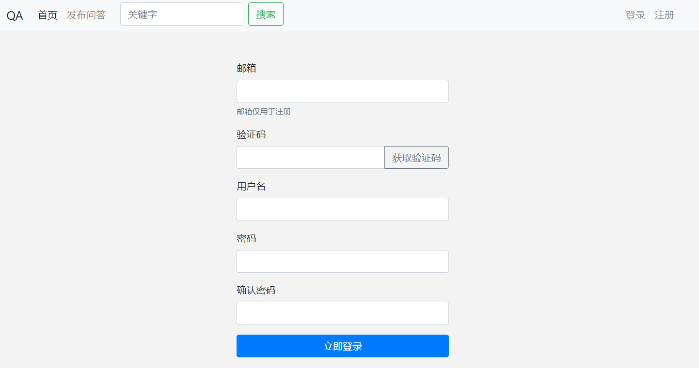
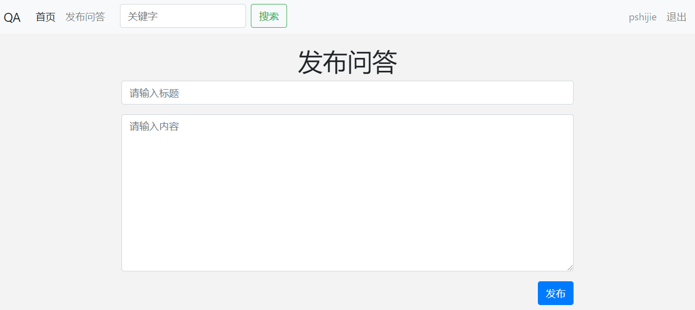
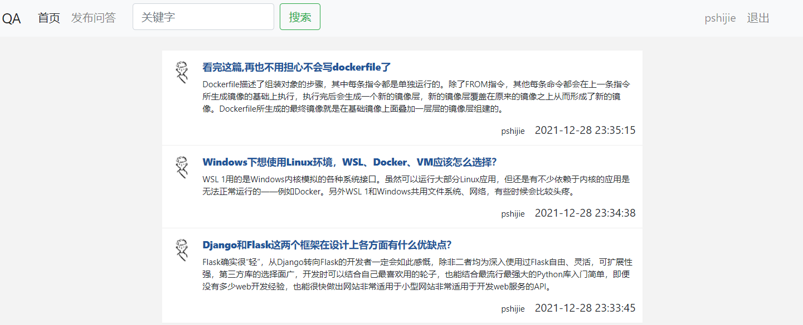
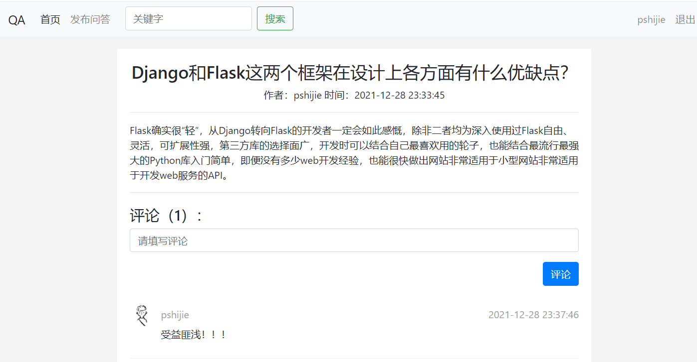
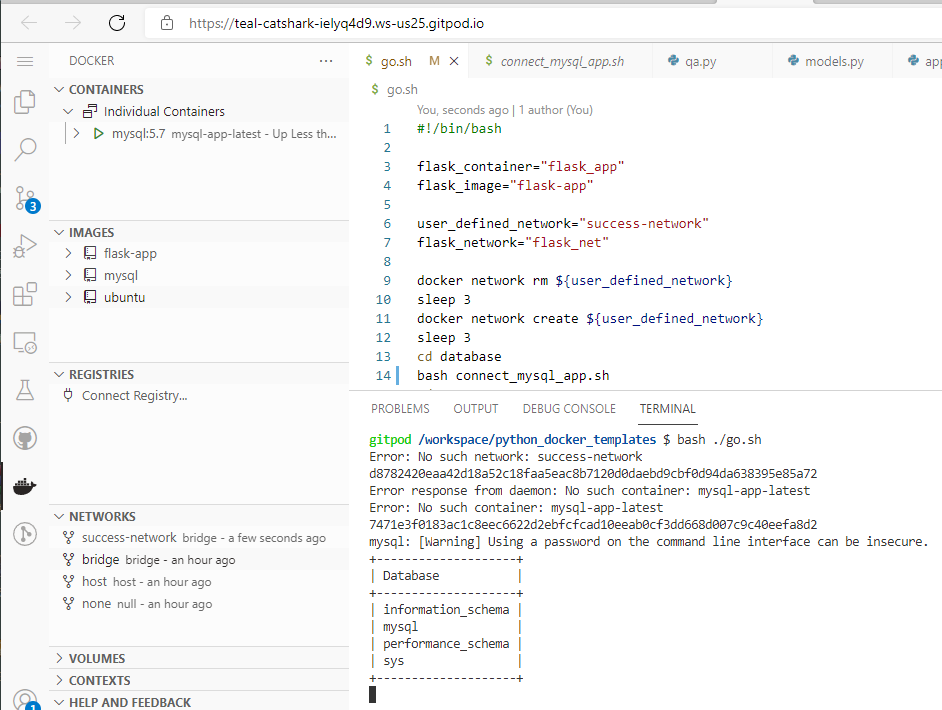
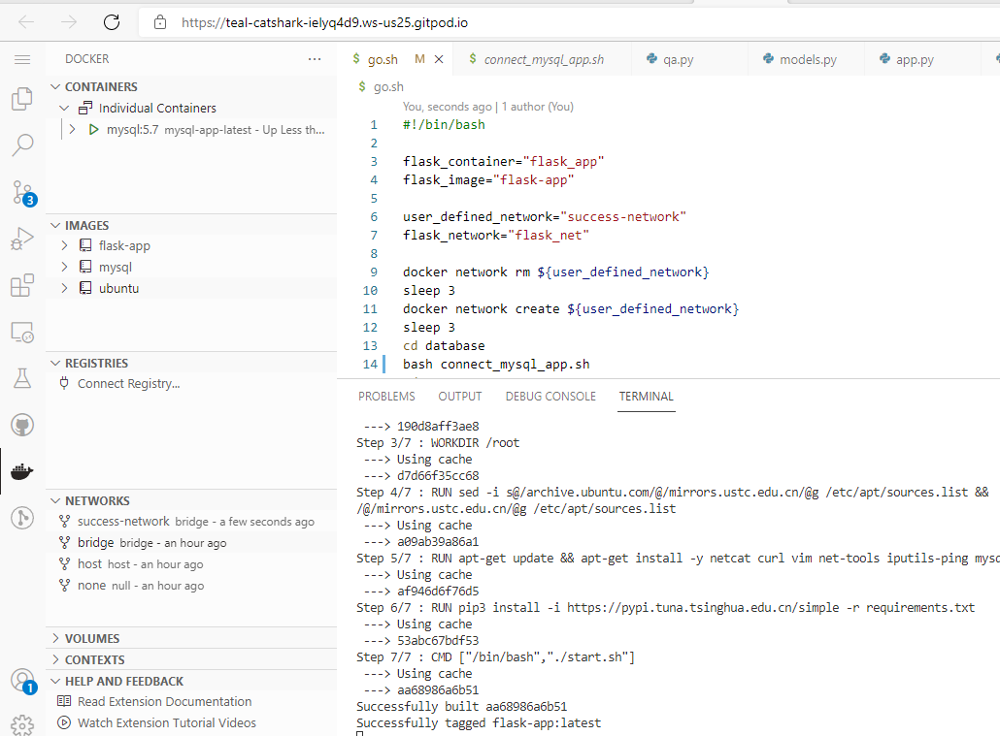
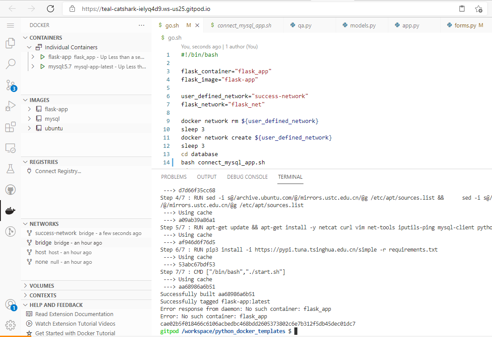
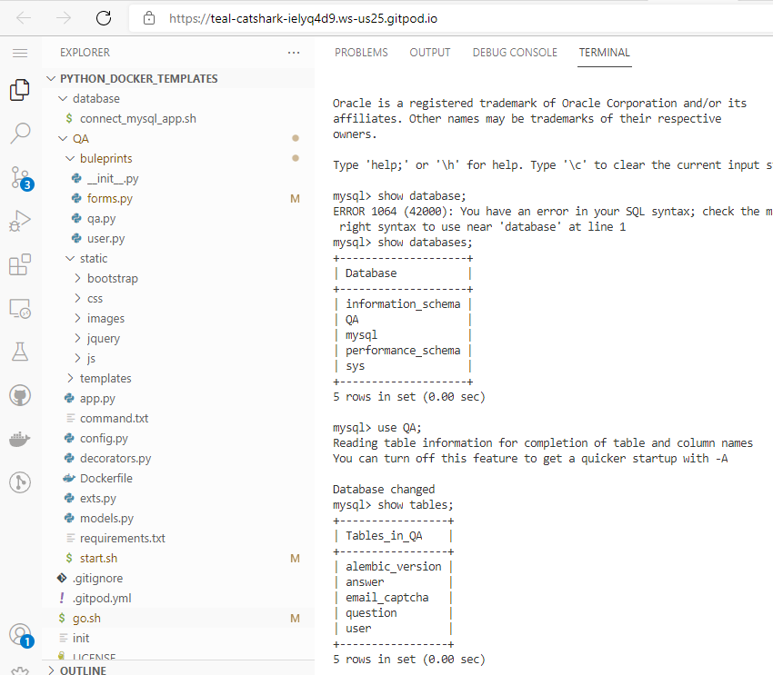

# 1. 项目功能简介

- 用户注册：

    Ⅰ、用户输入邮箱

    Ⅱ、获取验证码，等待邮箱发送验证码

    Ⅲ、输入注册的用户名和密码，并对密码进行确认

    Ⅳ、校验后完成注册

- 用户登录：

    Ⅰ、输入邮箱和密码

    Ⅱ、校验后完成登录


- 发布问答：

    Ⅰ、已登录用户点击发布问答按钮，进入到发布问答页面
    
    Ⅱ、输入标题和内容
    
    Ⅲ、经过格式校验后点击发布按钮，完成发布 


- 评论：

    Ⅰ、已登录用户点击帖子进入其页面
    
    Ⅱ、输入评论内容

    Ⅲ、经过格式校验后点击评论按钮，完成评论


- 关键字搜索：

    Ⅰ、在搜索框中输入要搜索的标题/帖子的部分关键字
    
    Ⅱ、点击搜索按钮，完成相关内容的搜索


# 2. 程序运行方式

- 大致流程：

>  本项目有两个应用容器，一个是flask容器，一个是mysql容器。首先需要再宿主机上先运行mysql容器，并且宿主机能够配置和访问mysql，当这一步完成之后，宿主机再次运行flask容器，由于flask容器需要连接mysql容器，所以需要使用docker容器通信技术，完成两个容器通信之后，再次运行flask。

- 具体流程

> ​	根据velcom的创建连接Mysql的bash脚本，本实验在此脚本上做了一些改动，在docker run命令加入了—network，在此之前需要先用指令：docker network create success-network创建网络，之后加入success-network，指令如下：
>
> ```bash
> User_defined_network=”success-network”
> docker network create ${user_defined_network}
> docker run --name ${container_name} \
>             -e MYSQL_ROOT_PASSWORD=${db_rootpass} \
>             --network ${user_defined_network} \
>             --network-alias ${mysql_network} \
>             -p 49156:3306 \
>             -d mysql:5.7
> ```
>
> ​	network-alias是给加入success-network网络的容器起了网络别名，这样做的目的是在运行flask容器的时候，可以用mysql_net作为连接数据库用的hostname。经过摸索，本实验所用的mysql版本是5.7。
>
> ​	在上述的基础上，docker运行flask容器指令如下：
>
> ```bash
> docker run --network ${user_defined_network} \
>             --network-alias ${flask_network} \
>             --name ${flask_container} \
>             -dp 5000:5000 ${flask_image}
> ```
>
> ​	因为flask连接数据库用的是flask内置的连接数据库的框架，在QA/config.py文件的第一行hostname，使用的是mysql_net网络别名，在flask容器里具体连接mysql容器指令如下：
>
> ```bash
> mysql -u root -h ${mysql_network} -P 3306 -p${db_rootpass} -e
> ```
>
> ​	在flask运行之前，需要分别运行flask db init，flask db migrate，flask db upgrade，并且需要数据库提前创建好数据库QA，把以上指令放进 QA/start.sh脚本里，如下：
>
> ```bash
> mysql -u root -h ${mysql_network} -P 3306 -p${db_rootpass} -e "
> CREATE DATABASE ${db_name} CHARACTER SET utf8mb4;
> SHOW DATABASES;
> "
> sleep 3
> flask db init
> sleep 2
> flask db migrate
> sleep 4
> flask db upgrade
> sleep 4
> 
> python3 app.py
> ```
>
> ​	每一步flask db的操作都需要sleep若干秒，防止创建表失败。当以上步骤都完成之后，就可以运行flask的web应用了。之后，将上述的整个流程写在项目根目录下的脚本里，位置在/go.sh，使用Bash ./go.sh可以自动化上述步骤。


# 3.程序运行截图

- 用户注册



- 用户登录


- 发布问答





- 评论



- 关键字搜索


- 运行mysql容器



- 创建flask的image



- 运行flask容器



- 创建QA数据库


